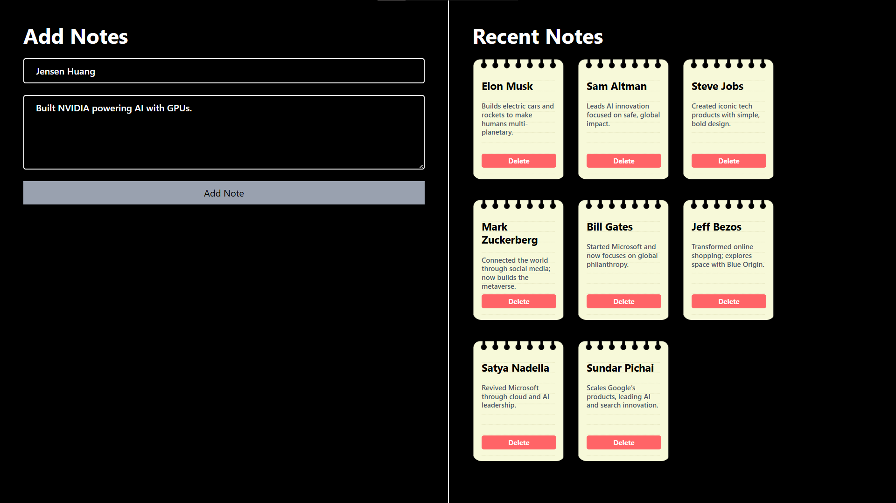

# 📝 Simple Notes App (React + Tailwind)

A clean and minimal Notes App built using **React.js** and **Tailwind CSS**.  
It lets users create small notes with title + details and display them like sticky notes.

---

## 🚀 Features

- ➕ Add notes with title and details
- 🗑️ Delete notes individually
- 🎨 Beautiful sticky-note UI
- 🧭 Responsive layout
- ⚛️ Single file logic (App.jsx)

---

## 🛠️ Tech Stack

| Tool          | Purpose          |
| ------------- | ---------------- |
| React.js      | UI Library       |
| Tailwind CSS  | Styling          |
| useState Hook | State Management |

---

## 📁 Project Structure

<pre>
NOTES-APP/
│
├── node_modules/
│
├── public/
│
├── src/
│   ├── assets/
│   ├── components/
│   ├── App.jsx
│   ├── index.css
│   └── main.jsx
│
├── .gitignore
├── eslint.config.js
├── index.html
├── package-lock.json
├── package.json
├── README.md
└── vite.config.js
</pre>

---

## 🎨 UI Preview

Below is a preview of the Notes App interface:

> 

---

## 🧠 How It Works

- **title & details** → controlled inputs stored in state
- **task (array)** → stores all notes as objects
- **submitHandler()** → adds a new note
- **deleteNote()** → removes note using index
- `.map()` → renders all notes in UI

---

## 👨‍💻 Developer

**Made with 🤍 by [Gulam Mohyudin Memon](https://www.linkedin.com/in/gulammohyudin-memon/)**

---

### ⭐ If you like it...

Give this repo a **star** ⭐ and share it with your friends who think they have good memory!
